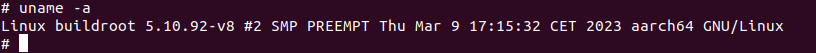
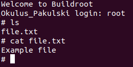

# Sprawozdanie z ćwiczenia nr 1

## Przygotowanie stanowiska laboratoryjnego

Stanowisko składamy zgodnie z instrukcją laboratoryjną. Po sprawdzeniu
poprawności połączenia przez prowadzącego uruchamiamy urządzenie.

Łączymy się za pomocą `tio` poleceniem `tio /dev/ttyUSB0`. Weryfikujemy,
że system ratunkowy Buildroot uruchamia się.

Uruchamiamy `udhcpc`. Połączenie internetowe posłuży do przesyłania
plików. Sprawdzamy i zapisujemy numer IP hosta za pomocą `ifconfig`.

## Konfiguracja z initramfs

Rozpakowujemy pobrany `buildroot-2022.11.2.tar.gz`. Wykonujemy `make
raspberrypi4_64_defconfig` dla bazowej konfiguracji. Kolejno w `make
menuconfig` ustawiamy toolchain `Toolchain -> Toolchain type (External
toolchain)`, dodajemy tmux `System configuration -> Generate locale data
(en_US.UTF-8)` (potrzebne do działania tmux'a) i `Target packages -> Shell and
utilities -> tmux`. Ustawiamy hostname `System configuration -> System hostname (Okulus_Pakulski)`.
W `Filesystem images` wybieramy `cpio the root filesystem` z opcją kompresji
`gzip` oraz `initial RAM filesystem linked into linux kernel`. Odznaczamy
`ext2/3/4 root filesystem`.

Wszystko kompilujemy za pomocą `make`. Możemy otrzymać błąd, że przykładowy
skrypt `post-image.sh` nie może znaleźć `rootfs.ext4`, jednak możemy go
zignorować, ponieważ skrypt ten tworzy `sdcard.img`, którego nie używamy. Skrypt
ten można wyłączyć w `System configuration -> Custom scripts to run after
creating filesystem`.

Przechodzimy do `output/images` i uruchamiamy serwer http `python3 -m
http.server`. W systemie ratunkowym pobieramy `Image`, `bcm2711-rpi-4-b.dtb`
oraz `rpi-firmware/cmdline.txt` za pomocą komendy `wget http://<ip z
ifconfig>:8000/<nazwa>`. Montujemy partycję boot `mount /dev/mmcblk0p1 /mnt` i
przenosimy pliki `bcm2711-rpi-4-b.dtb` oraz `cmdline.txt`. Plik `Image`
przenosimy jako `kernel8.img`. Restartujemy RP przytrzymując przycisk SW4,
system z initramfs bootuje się poprawnie.

Ponieważ jak nazwa wskazuje ten system plików jest w pamięci RAM pliki tworzone
nie istnieją po ponownym uruchomieniu, co weryfikujemy eksperymentalnie i
konsultujemy z prowadzącym.

## Konfiguracja z rootfs

Wykorzystujemy większość konfiguracji z initramfs. Wybieramy `Filesystem images
-> ext2/3/4 root filesystem`. Odznaczamy `cpio the root filesystem...` oraz
`initial RAM filesystem...`. Dodatkowo zwiększmy rozmiar rootfs do 128M (opcja
`exact size`. W przypadku mniejszych wartości następuje błąd kompilacji.

Usuwamy poprzednie jądro poleceniem `make linux-dirclean`. Dzięki temu
kompilacja będzie trochę szybsza, bo na przykład nie będzie trzeba ponownie
kompilować tmux'a. Kompilujemy jądro za pomocą `make`. Tak jak poprzednio może
pojawić się błąd związany z `post-image.sh`, który możemy ignorować.
Wygenerowany plik `Image` jest mniejszy niż w poprzednim przypadku co wynika z
tego, że system plików jest teraz oddzielnie, w `rootfs.ext2`.

Ponownie uruchamiamy system ratunkowy za pomocą `reboot`. Znowu pobieramy pliki
`Image`, `bcm2711-rpi-4-b.dtb`, `rpi-firmware/cmdline.txt`, ale teraz również
`rootfs.ext2`. Montujemy partycję boot i przesyłamy pliki do `/mnt/user` tak jak
poprzednio. Dodatkowo kopiujemy system plików na partycję `rootfs` za pomocą `dd
if=rootfs.ext2 of=/dev/mmcblk0p2 bs=4096`. Pliku `rootfs.ext2` nie musimy usuwać
bo sam system ratunkowy jest w postaci initramfs, nie zostaje on zatem zapisany
na kartę SD. Ponownie wywołujemy `reboot` z przytrzymaniem przycisku. W systemie
z rootfs tworzymy plik `file.txt` z tekstem `Example file`. Po kolejnym `reboot`
z przytrzymaniem przycisku plik ten nadal znajduje się na karcie, co weryfikuje
prowadzący. Jest to już zwykły system plików znajdujący się na karcie SD, która
jest pamięcią nieulotną.

## Podsumowanie

Udało nam się utworzyć i uruchomić obydwie wersje systemu. Za pomocą buildroot'a
można wygodnie tworzyć klasyczne obrazy z systemem plików oraz te z initramfs,
który jest bardzo przydatny np. dla systemu ratunkowego - ewentualne zmiany są
wykonywane tylko w pamięci RAM, więc po każdym uruchomieniu zaczynamy w tym
samym środowisku, co znacząco zmniejsza szanse na konieczność ponownego
wgrywania całego obrazy karty SD.
