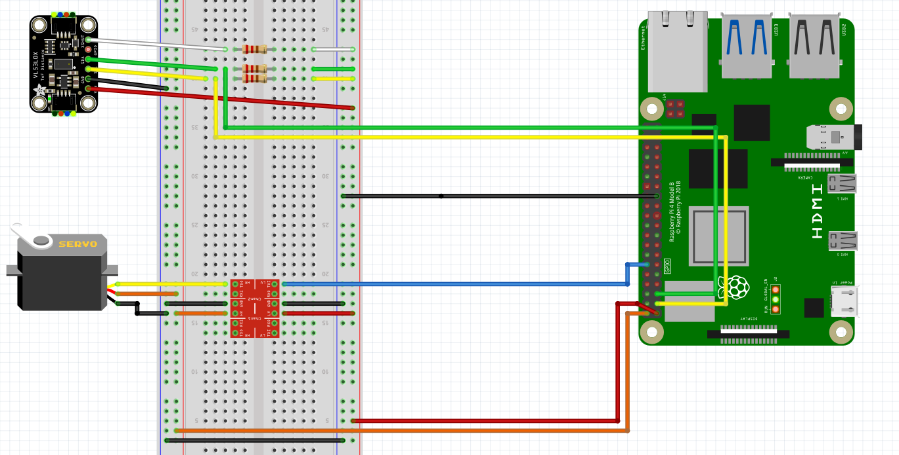

# Opis projektu

Wybranym przez nas tematem projektu jest LIDAR, który składa się z czujnika
VL53L0 umieszczonego na serwomotorze. Wraz z obrotem czujnik sprawdza odległość
we wszystkich kierunkach, która jest przesyłana przez serwer UDP.

# Czujnik VL53L0

## Opis i sterowanie

Czujnik odległości to laserowy czujnik typu Time of Flight. Jest sterowany przez
interfejs i2c na adresie 0x29. Do jego obsługi wykorzystaliśmy bibliotekę
napisaną w C, która jest dostępna pod adresem
https://github.com/bitbank2/VL53L0X. Zdecydowaliśmy się na tę bibliotekę,
ponieważ jest bardzo prosta w użyciu - po zainicjalizowaniu odległość w
milimetrach możemy pobrać funkcją `tofReadDistance()`.

## Podłączenie

Układ ma następujące wejścia - VIN, GND, SCL, SDA, GPIO, XSHUT. Wejście VIN to
wejście zasilające, należy je podłączyć bezpośrednio to zasilania 3.3V. GND
oznacza uziemienie, wystarczy połączyć je zwyczajnie. Pin GPIO nie jest używany
i zostawiamy go jako niepodłączony. Pozostałe piny SCL, SDA i XSHUT trzeba
podłączyć przy pomocy tzw. rezystora "pull-up" - poza połączeniem z RPI należy
również dołączyć zasilanie 3.3V przez rezystor. Ta potrzeba wynika z
wewnętrznego działania I2C. Połączenie to jest widoczne na schemacie w dalszej
części sprawozdania. Pin XSHUT daje możliwość wyłączania i włączania urządzenia
w celu oszczędności energii, jednak nie korzystamy z tej możliwości w projekcie
i pin zostawiamy podłączyny tylko przez pull-up. Wejścia SDA i SCL odpowiednio
podłączamy do płytki.

# Serwomotor

## Opis i sterowanie

Serwomotor jest sterowany falą PWM. Okres fali wynosi 20 ms, a czas wypełnienia
od 1 do 2 ms. Kąt docelowy dla serwomotoru jest najmniejszy, gdy wypełnienie
fali jest najmniejsze i największy, gdy wypełnienie jest największe.

## Podłączenie

Serowmotor jest zasilany i sterowany napięciem 5V. Poziomy logiczne na RPI
wynoszą 3.3V, więc żeby nie zniszczyć płytki należy użyć konwertera napięć. Musi
byc on podłączony z obu stron do uziemienia GND oraz odpowiednio zasilaniem 5V i
3.3V z odpowiednich stron. Sposób połączenia jest widoczny na schemacie.

# Schemat połączenia

Schemat jest dostępny w repozytorium w pliku schemat.fzz.

# Serwer

Serwer UDP działający na RPI jest napisany w języku C++ i działa na porcie 9090.
Serwer może obsłużyć dowolną liczbę klientów. Aby zacząć otrzymywać komunikaty
klient powinien wysłać pakiet z wiadomością START, a kiedy nie chce już ich
dalej otrzymywać np. przy zakończeniu programu powinien wysłać pakiet STOP.

# Klient

Klient został napisany oryginalnie w języku C++ i wyświetlał otrzymane dane
poprzez bibliotekę matplotlib-cpp (https://github.com/lava/matplotlib-cpp),
jednak w trakcie laboratorium nie mogliśmy skompilować klienta na komputerze w
sali, więc dodatkowo utworzyliśmy plik `client.py`, który zawiera analogiczny
program napisany w Pythonie, który działa normalnie na komputerze w sali
laboratoryjnej.

# Instalacja na RPI

Na RPI należy w `/boot/config.txt` należy dodać `dtoverlay=i2c1` oraz
zainstalować dodatkowo `kmod-i2c-bcm2835`. Pakiet serwera w formacie ipkg jest
budowany przez SDK OpenWRT, należy użyć polecenia `make` w katalogu `projekt`,
co pobiera SDK, odpowiednio je konfiguruje, buduje pakiet i kopiuje go do
katalogu bazowego.

# Sposób generowania fali PWM

Początkowo zdecydowaliśmy się generować falę PWM sprzętowo, przez sysfs. Taka
implementacja jest najwygodniejsza i najefektowniejsza, nie musimy wtedy sami w
pętli generować fali, tylko ustawiamy jej odpowiednie parametry. Niestety nie
udało nam się włączyć tego interfejsu - zarówno `dtoverlay=pwm-2chan` jak i
`dtoverlay=pwm,pin18,func=2` nie zadziałały. Finalnie wybraliśmy własne
generowanie fali w oddzielnym wątku. Oryginalna implementacja jest dostępna pod
tagiem `hardware-pwm` w repozytorium git.

# Podsumowanie

Udało nam się w większości zrealizować projekt. Niestety dużą część czasu na
pierwszych laboratoriach spędziliśmy na znalezieniu odpowiedniego sposobu
podłączenia VL53L0. Pomimo wczesniejszego przygotowania serwera, klienta i
obsługi serwomotora na drugich laboratoriach poświęciliśmy dużo czasu na
nieudane próby włączenia sprzętowego PWM, który finalnie musieliśmy napisać od
nowa. Klient również musiał zostać przepisany do Pythona.
